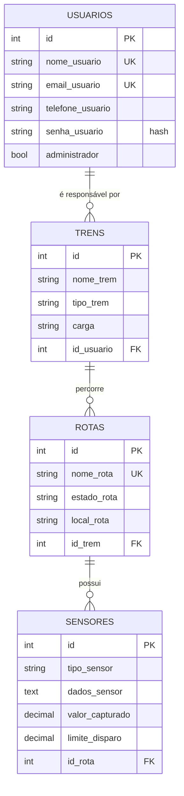

# Modelo de dados

```mermaid
erDiagram
    USUARIOS ||--o{ TRENS : "é responsável por"
    TRENS    ||--o{ ROTAS : "percorre"
    ROTAS    ||--o{ SENSORES : "possui"

    USUARIOS {
        int id PK
        string nome_usuario UK
        string email_usuario UK
        string telefone_usuario
        string senha_usuario "hash"
        bool administrador
    }
    TRENS {
        int id PK
        string nome_trem
        string tipo_trem
        string carga
        int id_usuario FK
    }
    ROTAS {
        int id PK
        string nome_rota UK
        string estado_rota
        string local_rota
        int id_trem FK
    }
    SENSORES {
        int id PK
        string tipo_sensor
        text dados_sensor
        decimal valor_capturado
        decimal limite_disparo
        int id_rota FK
    }
```

Todas as chaves estrangeiras usam `ON DELETE RESTRICT`: um registro com dependentes
não pode ser apagado, e o sistema mostra uma mensagem explicando o motivo.
